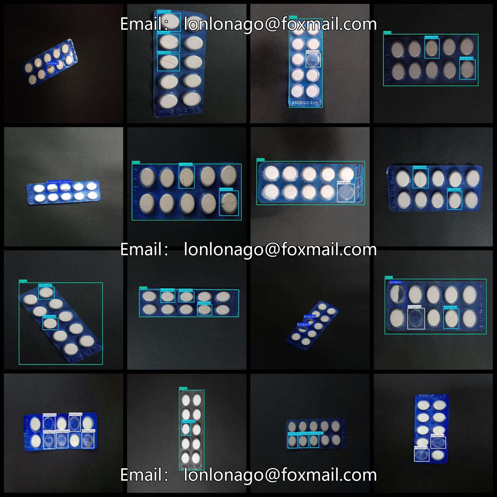
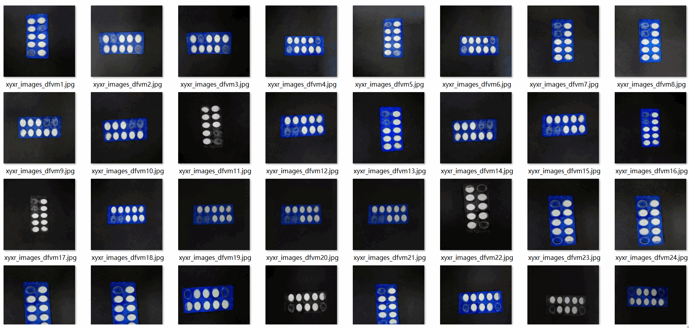

# Blister Pack Aluminum Foil Plate Defect Detection Dataset 2375 imagesVOC+YOLO format

The dataset format: Pascal VOC format + YOLO format (without the split path in the txt file, only containing JPG images as well as corresponding VOC format xml files and YOLO format txt files).

Number of images (JPG files): 2375

Number of annotations (xml files): 2375

Number of annotations (txt files): 2375

Number of annotation categories: 4

Repository: datasets_sl

Annotation category names according to the order in the labels folder (not in this order due to differences between the yolo format and the labels folder's classes.txt): ["broken", "cracked", "missing", "strip"]

Box count for each category:

Broken boxes count = 1259

Cracked boxes count = 1679

Missing boxes count = 1803

Strip boxes count = 1177

Total box count = 5918

Number of images per category:

Broken images count = 941

Cracked images count = 1052

Missing images count = 842

Strip images count = 1176

Image resolution: 720x720

Annotation tool used: labelImg

Dataset enhancement status: No

Annotation rules: Draw a rectangle around the category

Important notice: The dataset does not have been split into training, validation, or test sets; users need to do so themselves.

Special declaration: This dataset does not guarantee any accuracy for the models trained or weight files.

Annotation and image details are as follows:

## Images

---

Here is a pay link on Stripe (https://buy.stripe.com/3cs8yP7sY87d0vu9AB). Please contact me lonlonago@foxmail.com after funding $89, and I will send you a complete data files, thank you!

